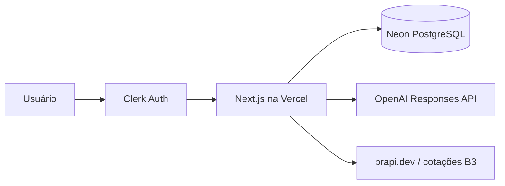

# Meu Caixa

Aplicação web de controle financeiro pessoal com receitas e despesas, cartões de crédito, investimentos, simulações e uma assistente financeira com IA.

## Arquitetura

- **Next.js 16**: interface e rotas de API no mesmo projeto.
- **Clerk**: cadastro, login e sessões seguras.
- **Neon PostgreSQL**: histórico financeiro persistente.
- **OpenAI API**: assistente que analisa apenas o contexto do usuário autenticado.
- **brapi.dev**: cotações e gráfico intradiário dos ativos B3 cadastrados pelo usuário.

## Proteção dos dados

Todas as tabelas financeiras possuem `owner_id`, preenchido com o identificador verificado pelo Clerk. As consultas, alterações e exclusões sempre combinam o registro com esse identificador, impedindo o acesso cruzado entre contas.

Segredos ficam somente em `.env.local` durante o desenvolvimento e nas variáveis protegidas da Vercel em produção. Arquivos `.env*` reais nunca devem ser enviados ao GitHub.

## Executar localmente

1. Instale o Node.js 22 ou superior.
2. Execute `npm install`.
3. Copie `.env.example` para `.env.local` e configure as variáveis.
4. Execute `npm run db:migrate` para preparar o banco.
5. Execute `npm run dev` e acesse `http://localhost:3000`.

## Variáveis de ambiente

| Nome                                | Visibilidade     | Uso                                                   |
| ----------------------------------- | ---------------- | ----------------------------------------------------- |
| `DATABASE_URL`                      | Somente servidor | Conexão PostgreSQL do Neon                            |
| `CLERK_SECRET_KEY`                  | Somente servidor | Validação de sessões                                  |
| `NEXT_PUBLIC_CLERK_PUBLISHABLE_KEY` | Pública          | Inicialização do Clerk no navegador                   |
| `OPENAI_API_KEY`                    | Somente servidor | Assistente financeira                                 |
| `OPENAI_MODEL`                      | Somente servidor | Modelo usado pela assistente                          |
| `BRAPI_TOKEN`                       | Somente servidor | Cotações B3; nunca deve usar o prefixo `NEXT_PUBLIC_` |

O painel de mercado consulta a fonte apenas enquanto a área de investimentos está aberta. Durante o pregão, atualiza a cada minuto; fora dele, reduz a frequência de verificação. A recência da cotação depende do plano contratado na brapi.dev e deve ser conferida pelo horário exibido na tela.

## Comandos

- `npm run dev`: inicia o ambiente local.
- `npm run build`: valida e gera a aplicação de produção.
- `npm run db:generate`: gera migrações após alterações no schema.
- `npm run db:migrate`: aplica migrações pendentes com segurança.
- `npm run lint`: executa a análise estática.

O comando `vercel-build` aplica somente migrações ainda pendentes e depois compila o aplicativo.
