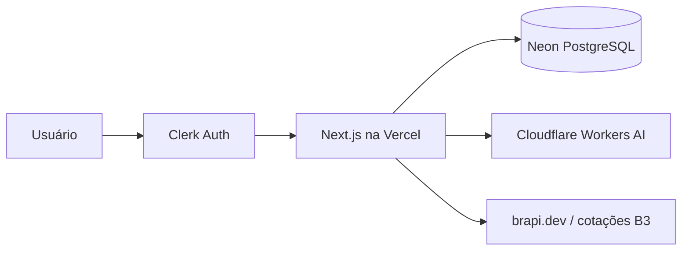

# Meu Caixa

Aplicação web de controle financeiro pessoal com receitas e despesas, cartões de crédito, investimentos, simulações e uma assistente financeira com IA.

## Contas e metas financeiras

- Em **Contas**, cadastre contas manuais (instituição, nome e saldo inicial), acompanhe o saldo individual/consolidado e transfira valores entre elas. Transferências internas não são receitas, despesas nem aportes para investimentos.
- Os registros anteriores continuam na **Conta principal**. Para separá-los por banco sem duplicar dinheiro, use uma transferência interna. Saldo inicial deve representar somente dinheiro ainda não contabilizado e não pode ser alterado pela edição da conta.
- Em **Metas**, defina objetivo e prazo, reserve dinheiro de uma conta e libere a reserva quando necessário. O progresso depende exclusivamente dessas reservas registradas; o aporte mensal necessário não presume rendimento.
- Reservas continuam na conta de origem. `Saldo livre = saldo confirmado - reservas`; valores reservados não podem ser transferidos ou aplicados sem antes serem liberados. Despesas manuais ainda podem tornar o saldo livre negativo, gerando um aviso para revisar lançamentos e reservas.
- Em **Gastos**, selecione a conta ao registrar/editar transações, confirmar recorrências ou aportar no calculador CDI/CDB. A busca avançada também filtra por conta.

As APIs de contas/metas usam exclusivamente o proprietário da sessão e as relações possuem chaves estrangeiras compostas por usuário. Transferências e reservas são atômicas, com trava por usuário e chave de idempotência para evitar duplicidade em reenvios. Nenhuma dessas funções conecta ou movimenta uma conta bancária real.

A migração aditiva `0005_oval_zaladane.sql` deve ser aplicada antes desta versão. Contas, metas, transferências internas e reservas fazem parte do backup JSON; arquivos antigos continuam aceitos, com conta principal e novas tabelas vazias.

Na área de Gastos, aportes são transferências da conta para a carteira: reduzem o saldo disponível, mas não são somados às despesas. Os orçamentos mensais por categoria comparam apenas despesas de consumo ao limite definido pelo usuário.

Recorrências mensais aparecem como **previsões** e não alteram o saldo até a confirmação explícita de cada ocorrência. A projeção de seis meses combina o saldo confirmado de hoje, ocorrências pendentes e lançamentos futuros já registrados.

Em **Seus dados e backup**, o usuário pode baixar as transações em CSV ou um JSON com todas as áreas financeiras e verificar/restaurar registros ausentes na mesma conta. Veja [o procedimento e as limitações](docs/backup-recovery.md).

## Visão Geral, alertas e busca avançada

- **Visão Geral** reúne o saldo confirmado até hoje, aportes, valores cadastrados dos ativos, faturas vencidas/a vencer em 30 dias, resumo do mês e recorrências pendentes. Saldo de aportes e carteira são apresentados separadamente: podem representar o mesmo dinheiro e não são somados como patrimônio. Faturas não são descontadas automaticamente da conta.
- O **sino** abre avisos de orçamento a partir de 80%, faturas vencendo em até 7 dias ou vencidas sem confirmação de pagamento, e recorrências do mês cuja data chegou e ainda não foram confirmadas. Desabilite cada tipo em Configurações. São alertas ativos calculados pelos registros, não mensagens enviadas pelo banco ou notificações externas.
- Em **Gastos → Busca avançada**, combine descrição (sem diferença de acentos), categoria, tipo, datas e valores mínimo/máximo. Datas vazias consultam todo o histórico. A busca pagina em 50 registros, com totais de todos os resultados e ordenação por data ou valor; não altera o resumo mensal. Compras de cartão continuam na área Cartões.

`GET /api/overview` e `GET /api/transactions/search` exigem autenticação, vinculam todas as consultas à sessão e respondem com `private, no-store`. O resumo é atualizado após gravações financeiras, ao navegar entre áreas, ao retornar à página e a cada cinco minutos enquanto ela está visível. Consultas antigas são canceladas para não sobrescrever resultados recentes. Nenhuma cotação externa é consultada pela Visão Geral.

As três preferências de alertas usam o JSON já existente: não é necessária nova migração. Preferências antigas preservam tema e área inicial; contas sem preferências começam na Visão Geral. A suíte inclui cenários de arredondamento, confirmação de recorrências, paginação, filtros inválidos, busca literal e isolamento entre usuários.

## Configurações do usuário

A aba **Configurações** reúne tema escuro/claro/sistema, texto ampliado, redução de animações, modo discreto, área inicial, atualização automática das cotações e acesso ao perfil e segurança do Clerk. Também concentra **Seus dados e backup**.

As preferências são salvas automaticamente em `user_preferences`, com uma linha por usuário autenticado. `GET/PUT /api/preferences` valida os campos e usa exclusivamente o proprietário da sessão; não aceita identidade enviada pelo navegador. Respostas não são armazenadas em cache compartilhado. A migração `0004_configuracoes_usuario.sql` é aditiva e deve ser aplicada antes de disponibilizar esta versão.

O modo claro usa cores semânticas para inverter os fundos e textos da paleta Luxe, mantendo a identidade champagne. O modo discreto mascara textos monetários e gráficos dos painéis, mas **não** é um controle de acesso: formulários, mensagens livres do chat e arquivos exportados continuam contendo valores. As preferências não são incluídas no backup financeiro, e restaurar preferências não modifica lançamentos ou saldos.

## Arquitetura

```mermaid
flowchart LR
  U[Usuário] --> C[Clerk Auth]
  C --> N[Next.js na Vercel]
  N --> P[(Neon PostgreSQL)]
  N --> O[Cloudflare Workers AI]
  N --> B[brapi.dev / cotações B3]
```

- **Next.js 16**: interface e rotas de API no mesmo projeto.
- **Clerk**: cadastro, login e sessões seguras.
- **Neon PostgreSQL**: histórico financeiro persistente.
- **Cloudflare Workers AI**: assistente com cota gratuita diária que analisa apenas o contexto do usuário autenticado. O serviço recebe o contexto financeiro necessário para gerar a resposta; confirme que essa transferência atende à sua política de privacidade.
- **brapi.dev**: cotações e gráfico intradiário dos ativos B3 cadastrados pelo usuário.

## Proteção dos dados

Todas as tabelas financeiras possuem `owner_id`, preenchido com o identificador verificado pelo Clerk. As consultas, alterações e exclusões sempre combinam o registro com esse identificador, impedindo o acesso cruzado entre contas.

Segredos ficam somente em `.env.local` durante o desenvolvimento e nas variáveis protegidas da Vercel em produção. Arquivos `.env*` reais nunca devem ser enviados ao GitHub.

## Executar localmente

1. Instale o Node.js 22.15 ou superior.
2. Execute `npm install`.
3. Copie `.env.example` para `.env.local` e configure as variáveis.
4. Execute `npm run db:migrate` para preparar o banco.
5. Execute `npm run dev` e acesse `http://localhost:3000`.

## Variáveis de ambiente

| Nome                                | Visibilidade     | Uso                                                   |
| ----------------------------------- | ---------------- | ----------------------------------------------------- |
| `DATABASE_URL`                      | Somente servidor | Conexão PostgreSQL do Neon                            |
| `CLERK_SECRET_KEY`                  | Somente servidor | Validação de sessões                                  |
| `NEXT_PUBLIC_CLERK_PUBLISHABLE_KEY` | Pública          | Inicialização do Clerk no navegador                   |
| `CLOUDFLARE_ACCOUNT_ID`             | Somente servidor | Conta Cloudflare para Workers AI                      |
| `CLOUDFLARE_WORKERS_AI_TOKEN`       | Somente servidor | Token restrito ao Workers AI                          |
| `BRAPI_TOKEN`                       | Somente servidor | Cotações B3; nunca deve usar o prefixo `NEXT_PUBLIC_` |

O painel de mercado consulta a fonte apenas enquanto a área de investimentos está aberta. Durante o pregão, atualiza a cada minuto; fora dele, reduz a frequência de verificação. A recência da cotação depende do plano contratado na brapi.dev e deve ser conferida pelo horário exibido na tela.

Para ativar a assistente, crie um token restrito ao Workers AI no painel da Cloudflare e configure as duas variáveis acima nos ambientes da Vercel. A cota gratuita é limitada e pode variar conforme o modelo; ao esgotá-la, a assistente informa que é preciso tentar mais tarde. Nunca coloque o token no navegador, em variáveis `NEXT_PUBLIC_` ou no GitHub.

## Comandos

- `npm run dev`: inicia o ambiente local.
- `npm run build`: valida e gera a aplicação de produção.
- `npm run db:generate`: gera migrações após alterações no schema.
- `npm run db:migrate`: aplica migrações pendentes com segurança.
- `npm run lint`: executa a análise estática.
- `npm test`: verifica cálculos e isolamento entre contas em um PostgreSQL temporário em memória.

Os testes de segurança simulam duas identidades autenticadas e exercitam as rotas reais de transações, orçamentos, cartões, investimentos, recorrências, simulações, backup e o contexto enviado à IA. Não utilizam o banco Neon nem chamam o provedor de IA. O GitHub Actions executa os testes e a checagem de tipos em cada pull request e push para `main`. Isso valida as regras da aplicação, mas não substitui um teste de login real no Clerk nem uma auditoria de segurança em produção.

O comando `vercel-build` aplica somente migrações ainda pendentes e depois compila o aplicativo.
